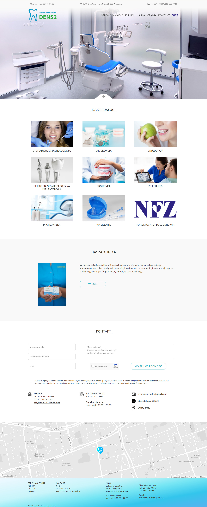

# StomatologiaDENS2
http://www.stomatologiabudel.pl/

Commercial website for dental clinic.
Website was built on Wordpress what allows the client to change content using CMS panel (section price and job offers).

Layout was created by me in Figma.
The final layout was changed a bit - client changes. Please see under the link https://github.com/OlaBartnik/Stomatologia-DENS2-Client-Changes

## Technologies
* HTML5
* CSS
* SASS
* JavaScript - slider, photo gallery,hamburger menu, Mapbox map, price table (CMS panel for the client)
* Wordpress / PHP
* RWD

